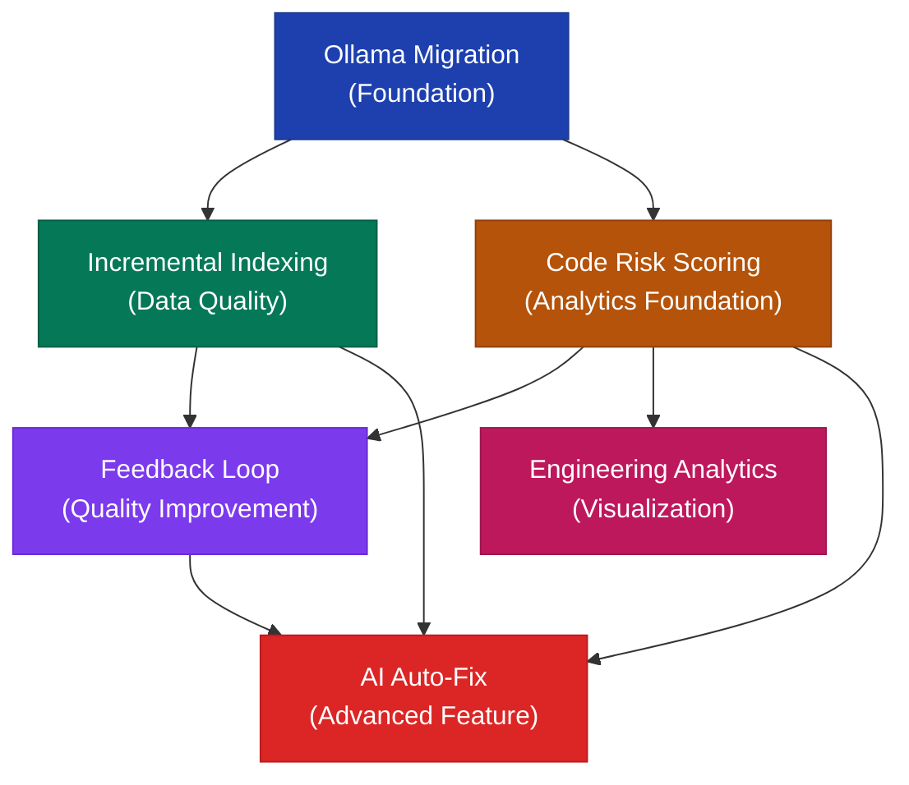

# 🗺️ PHASE 4 — EXECUTION PRIORITY ROADMAP

---

## 1. Feature Dependency Graph



### Dependency Justification

| From                                  | To                                                                                                              | Why?                                 |
| ------------------------------------- | --------------------------------------------------------------------------------------------------------------- | ------------------------------------ |
| Ollama Migration → Everything         | All features should be built on the new LLM layer, not Gemini                                                   | Foundation must be laid first        |
| Ollama → Incremental Indexing         | New embedding model (768d) requires re-indexing. Build smart indexing during this migration.                    | Kill two birds with one stone        |
| Ollama → Risk Scoring                 | Risk scoring's optional LLM-based security analysis should use the new provider                                 | Avoid building on deprecated API     |
| Incremental Indexing → Feedback Loop  | Fresh, accurate embeddings improve retrieval → better reviews → more meaningful feedback                        | Data quality prerequisite            |
| Risk Scoring → Feedback Loop          | Feedback needs review sections to rate → Risk score provides structured sections                                | Structural dependency                |
| Risk Scoring → Analytics              | Analytics visualizes risk score trends, distributions, hotspots                                                 | Data dependency                      |
| Feedback + Risk + Indexing → Auto-Fix | Auto-fix needs: quality context (indexing), identified issues (risk scores), and quality calibration (feedback) | All upstream features feed into this |

---

## 2. What Should Be Implemented First?

### Priority Order

| Priority | Feature                          | Justification                                                                                                               |
| -------- | -------------------------------- | --------------------------------------------------------------------------------------------------------------------------- |
| **#1**   | **Ollama Migration**             | Foundation for everything. Eliminates external API cost. Must happen before adding more LLM features.                       |
| **#2**   | **Incremental Indexing**         | Fixes the #1 scalability risk. Required during Ollama migration (dimension change = re-indexing). Build smart indexing now. |
| **#3**   | **Code Risk Scoring**            | Low-risk feature (static analysis, no LLM dependency for v1). Provides data foundation for analytics and auto-fix.          |
| **#4**   | **Engineering Analytics**        | Replaces fake data (technical debt). Uses risk scoring data. High demo impact.                                              |
| **#5**   | **Self-Improving Feedback Loop** | Requires mature review pipeline. Needs enough historical data. Benefits from stable analytics.                              |
| **#6**   | **AI Auto-Fix PR Generation**    | Highest complexity, highest risk. Needs all upstream features stable. Premium-tier feature.                                 |

---

## 3. What Can Be Built In Parallel?

### Parallelization Matrix

```
                    Week 1-2   Week 3-4   Week 5-6   Week 7-8   Week 9-10  Week 11-12
                    ────────   ────────   ────────   ────────   ────────   ──────────
Ollama Migration    ████████   ████████
                                  │
Incremental Index             ████████   ████████
                                            │
Risk Scoring           (v1 can start)   ████████   ████████
                                                      │
Analytics                                          ████████   ████████
                                                                  │
Feedback Loop                                                 ████████   ████████
                                                                            │
Auto-Fix                                                                ████████ → →
```

### Parallel Work Streams

| Stream A (Backend/LLM)     | Stream B (Frontend/Data) | Can Parallel?                   |
| -------------------------- | ------------------------ | ------------------------------- |
| Ollama provider code       | Risk scoring patterns    | ✅ Yes — independent work       |
| Ollama embedding migration | Analytics DB schema      | ✅ Yes — different layers       |
| Auto-fix LLM prompts       | Analytics dashboard UI   | ✅ Yes — different layers       |
| Feedback aggregation       | Analytics visualization  | ✅ Yes — after schema is shared |

---

## 4. What Should Be Avoided Early?

| ❌ Avoid                                                      | Why                                                              |
| ------------------------------------------------------------- | ---------------------------------------------------------------- |
| AI Auto-Fix before risk scoring works                         | Auto-fix needs structured issue identification from risk scores  |
| Engineering Analytics before real data exists                 | Analytics on fake data is useless; need risk scores and feedback |
| Complex multi-model routing before single model works         | Optimize one model first, then add routing                       |
| Production deployment of new Inngest functions before testing | Inngest jobs are hard to debug in production                     |
| Database migrations all at once                               | Migrate incrementally per feature to reduce blast radius         |
| Frontend work before backend stabilizes                       | UI changes are fast but backend APIs change frequently           |

---

## 5. Phase-Wise Timeline

### Phase 1: Foundation (Weeks 1-4) — v2.0

**Theme**: Replace external dependencies, build scalable infrastructure

```
WEEK 1-2: Ollama Migration Core
├── Day 1-2: Create module/llm/ abstraction layer
├── Day 3-4: Implement OllamaProvider + EmbeddingProvider
├── Day 5-6: Refactor AI tools (summarize, generate, playground)
├── Day 7-8: Refactor review pipeline
├── Day 9-10: Shadow mode testing (Gemini vs Ollama comparison)
└── Day 11-14: Canary deployment + monitoring

WEEK 3-4: Incremental Indexing
├── Day 1-2: IndexingState model + migration
├── Day 3-4: Git Tree API integration
├── Day 5-6: File prioritization engine
├── Day 7-8: Rewrite indexRepo function
├── Day 9-10: Incremental update function
├── Day 11-12: Background sync cron job
├── Day 13: Re-index all connected repos (with new 768-dim embeddings)
└── Day 14: End-to-end testing

CHECKPOINT v2.0:
✅ Self-hosted LLM (no more Google API costs)
✅ Smart incremental indexing (no more full-repo fetches)
✅ Fresh embeddings on every PR
✅ All existing features still work
```

### Phase 2: Intelligence (Weeks 5-8) — v2.5

**Theme**: Add machine intelligence and data infrastructure

```
WEEK 5-6: Code Risk Scoring Engine
├── Day 1-2: RiskScore model + migration
├── Day 3-4: Static analysis patterns (security, complexity)
├── Day 5-6: Risk calculation engine
├── Day 7-8: Integration with review pipeline (parallel step)
├── Day 9-10: Risk score in GitHub comments
├── Day 11-12: Risk badge in dashboard
├── Day 13-14: Testing + pattern tuning

WEEK 7-8: Engineering Analytics Dashboard
├── Day 1-2: AnalyticsSnapshot + FileHotspot models
├── Day 3-4: Aggregation Inngest function
├── Day 5-6: Replace fake dashboard data with real queries
├── Day 7-8: Risk trend chart + review volume chart
├── Day 9-10: File hotspot table
├── Day 11-12: Analytics page + sidebar navigation
├── Day 13: PRO tier gating for advanced analytics
└── Day 14: Testing

CHECKPOINT v2.5:
✅ Every PR gets a risk score
✅ Real analytics dashboard (no more fake data)
✅ File hotspot identification
✅ Trend tracking over time
```

### Phase 3: Learning (Weeks 9-12) — v3.0

**Theme**: Close the feedback loop, enable AI auto-remediation

```
WEEK 9-10: Self-Improving Feedback Loop
├── Day 1-2: ReviewFeedback + FeedbackAggregation models
├── Day 3-4: Feedback submission API
├── Day 5-6: Feedback UI on review cards
├── Day 7-8: Aggregation cron job
├── Day 9-10: Dynamic prompt injection from feedback
├── Day 11-12: Feedback stats in analytics dashboard
├── Day 13-14: Testing + validation

WEEK 11-12: AI Auto-Fix PR Generation
├── Day 1-2: AutoFix model + user preference fields
├── Day 3-4: Fix generation LLM prompts
├── Day 5-6: GitHub fix operations (branch, commit, PR)
├── Day 7-8: Inngest autofix function
├── Day 9-10: Review pipeline integration (eligibility check)
├── Day 11-12: Settings UI for opt-in
├── Day 13: Fix PR template + notification
└── Day 14: End-to-end testing with safety guards

CHECKPOINT v3.0:
✅ Reviews improve over time based on team feedback
✅ AI can generate fix PRs for identified issues
✅ Full pipeline: review → score → feedback → improve → fix
```

---

## 6. Architecture Maturity Roadmap

```
v1.0 (CURRENT)
├── Gemini API (external dependency)
├── Full-repo indexing (expensive, stale)
├── Basic text review (unstructured)
├── Fake analytics data
├── No feedback mechanism
└── No automated fixes

v2.0 (AFTER PHASE 1)
├── Self-hosted Ollama (zero API cost)
├── Smart incremental indexing
├── Structured reviews (system prompt + format)
├── Fresh embeddings per PR
├── LLM abstraction layer
└── Provider-agnostic architecture

v2.5 (AFTER PHASE 2)
├── Risk scoring on every PR
├── Real analytics dashboard
├── File hotspot detection
├── Static analysis patterns
├── PRO tier differentiation
└── Data-driven insights

v3.0 (AFTER PHASE 3)
├── Self-improving reviews via feedback
├── AI auto-fix PR generation
├── Full closed-loop system
├── Enterprise-ready quality metrics
├── Autonomous code quality management
└── Production-grade SaaS
```

---

## 7. Versioning Plan

| Version  | Codename       | Focus            | Features                               |
| -------- | -------------- | ---------------- | -------------------------------------- |
| **v2.0** | "Independence" | Infrastructure   | Ollama migration, incremental indexing |
| **v2.1** | "Intelligence" | Risk analysis    | Code risk scoring engine               |
| **v2.5** | "Insight"      | Analytics        | Engineering analytics dashboard        |
| **v2.7** | "Wisdom"       | Learning         | Self-improving feedback loop           |
| **v3.0** | "Autonomy"     | Auto-remediation | AI auto-fix PR generation              |
| **v3.5** | "Scale"        | Enterprise       | Multi-tenant, team collaboration       |
| **v4.0** | "Enterprise"   | Full SaaS        | Multi-model routing, observability     |

---

## 8. Refactor Checkpoints

### After Each Phase

| Checkpoint              | Actions                                                                                                                        |
| ----------------------- | ------------------------------------------------------------------------------------------------------------------------------ |
| **After Phase 1**       | Code review refactor: ensure LLM abstraction is clean. Delete deprecated `gemini.ts` if Ollama is stable. Run full test suite. |
| **After Phase 2**       | Schema review: ensure analytics models are optimized. Index all queries. Profile dashboard performance.                        |
| **After Phase 3**       | Security audit: auto-fix code injection risks. Load testing: concurrent review + autofix jobs. Clean up TODO/FIXME comments.   |
| **Before v3.0 release** | Full architecture review. Remove all technical debt items from Phase 1 analysis. Update all documentation.                     |

### Specific Refactors Per Phase

```
Phase 1 Refactors:
├── Remove @ai-sdk/google from package.json (after stable)
├── Delete module/ai/lib/gemini.ts (after 30 days stable)
├── Fix all `text-3x1` → `text-3xl` typos
├── Remove Test model from schema.prisma
├── Add webhook signature verification
├── Remove hardcoded ngrok URL from trustedOrigins

Phase 2 Refactors:
├── Remove generateSampleReviews() from dashboard
├── Consolidate duplicate GitHub token fetching
├── Add proper error types (not generic Error)
├── Add rate limiting to AI API endpoints

Phase 3 Refactors:
├── Add comprehensive TypeScript types (remove `any`)
├── Add API error documentation
├── Add monitoring/alerting for all Inngest functions
├── Add database connection pooling review
```

---

## 9. Risk-Adjusted Timeline

|             | Best Case | Expected | Worst Case |
| ----------- | --------- | -------- | ---------- |
| **Phase 1** | 3 weeks   | 4 weeks  | 6 weeks    |
| **Phase 2** | 3 weeks   | 4 weeks  | 5 weeks    |
| **Phase 3** | 3 weeks   | 4 weeks  | 6 weeks    |
| **Total**   | 9 weeks   | 12 weeks | 17 weeks   |

### Risk Factors

| Risk                               | Phase | Impact                              | Buffer |
| ---------------------------------- | ----- | ----------------------------------- | ------ |
| Ollama model quality issues        | 1     | +1 week for model testing/switching |
| Pinecone re-indexing failures      | 1     | +3 days for debugging               |
| Risk scoring false positive tuning | 2     | +1 week for pattern refinement      |
| Auto-fix LLM hallucination issues  | 3     | +1 week for prompt engineering      |
| GitHub API rate limit issues       | 1,3   | +3 days per occurrence              |

---

## 10. Success Metrics Per Phase

| Phase   | Metric                   | Target                   |
| ------- | ------------------------ | ------------------------ |
| Phase 1 | Review latency (P95)     | < 30s                    |
| Phase 1 | Embedding cost           | $0 (self-hosted)         |
| Phase 1 | Index freshness          | < 1 hour old             |
| Phase 2 | Risk score coverage      | 100% of reviews          |
| Phase 2 | Dashboard load time      | < 2s                     |
| Phase 2 | Fake data remaining      | 0 instances              |
| Phase 3 | Feedback submission rate | > 10% of reviews         |
| Phase 3 | Auto-fix acceptance rate | > 30% of generated fixes |
| Phase 3 | Review helpful rate      | > 80% (from feedback)    |
